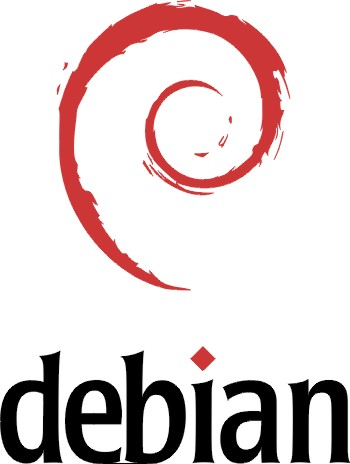

<!-- 
library(slidify)
library(slidifyLibraries)
-->

## CRAN packages


> - Who uses R packages?
> - Who has created R packages?
> - Exponential growth
> - 5000 pkgs on CRAN as of Nov 2013
> - More on BioConductor, Github, etc.

---

## What is a dependency?

```no-highlight
Package: dplyr
Type: Package
Title: dplyr: a grammar of data manipulation
Version: 0.1.1
Author: Hadley Wickham <h.wickham@gmail.com>, Romain Francois <romain@r-enthusiasts.com>
Maintainer: Hadley Wickham <h.wickham@gmail.com>
Description: A fast, consistent tool for working with data frame like objects, both in
  memory and out of memory.
URL: https://github.com/hadley/dplyr
Depends: R (>= 3.0.2)
Imports: assertthat, utils, methods, Rcpp
Suggests: hflights, RSQLite, RSQLite.extfuns, RMySQL, RPostgreSQL, data.table, 
  bigrquery, testthat, Lahman, knitr, microbenchmark, ggplot2, mgcv
```

---

## Depencency Types:

> - Dependencies between packages: `Depends`, `Imports`, `Suggests`, `Enhances`, `LinkingTo`.
> - R, Sweave, knitr script depends on package: `library(ggplot2)`
> - System/application embedded R functionality.

## Dependency Relations

> - Depends
> - Reverse Depends
> - Dependency Network (directed graph)
> - Indirect Dependencies (transitivity)

---

## Reverse Dependency Count


> - Some popular packages on CRAN
> - 370 packages depend on MASS (Aug 2012)
> - Counting recursive dependencies yields a different list (what would be on top?)

---

## Depenency Conflicts

> - DLL Hell (&reg; Microsoft)
> - R is in the same phase as Windows 98
> - All dependency relationships are unversioned
> - This assumes package versions are interchangable.
> - They are not.
> - Result: everything constantly breaks due to changes in dependencies.

---

## CRAN Policy

<q> For a package update, please check that any packages depending on this one still pass R CMD check: it is especially expected that you will have checked your own packages. A listing of the reverse dependencies of the current version can be found on the CRAN web page for the package.</q>

---

## Policy Implications

> - Package author responsible
> - Basically forbids any breaking changes / refactoring / cleanup
> - The more reverse dependencies a package accumulates, the harder it gets
> - Packages accumulating more legacy code
> - Popular packages get stuck completely
> - Does not solve the actual problem

---

## Problems

> - Packages break due to changing dependencies
> - R/Sweave/Knitr scripts unreliable
> - Building software on R very difficult
> - Reproducible research nearly impossible

## Suggested Solutions

> 1. Staged Distributions
> 2. Versioning Dependency Relations

---

## Staged distributions



> - Create software distributions
> - Introduce a <i>Release Cycle</i>
> - Ship a "frozen" library
> - Common in FOSS communities
> - Examples: GNU/Linux (e.g. Debian), Latex (e.g. MikTeX, TeXLive, etc)

---

## Staging CRAN


> - R already has a release cycle!
> - R has "release" and "devel" version.
> - Currently this is limited to "base" and "recommended" packages
> - Extend the release cycle to CRAN:
> - Freeze a snapshot of cran for each release
> - Push package updates only to -devel branch

---

## Staging CRAN

### Benefits:

> - Every release of R has fixed library of packages
> - Behavior of a given release of R is unambiguous
> - Given the version of R, a script should work years later
> - Pkg authors get freedom to implement breaking changes, cleanup

### Disadvantages

> - More conservative: users have packages that are a few months old.
> - Requires organization of release cycle.

---

## Versioning Dependency Relations


> - NPM: JavaScript Community
> - 60.000 NPM packages
> - No quality control
> - Stable development and deployment
> - How?

---

## Dependencies in NPM packages

### Special syntax to declare dependencies:

```no-highlight
{ "dependencies" :
  { "foo" : "1.0.0 - 2.9999.9999"
  , "bar" : ">=1.0.2 <2.1.2"
  , "baz" : ">1.0.2 <=2.3.4"
  , "boo" : "2.0.1"
  , "qux" : "<1.0.0 || >=2.3.1 <2.4.5 || >=2.5.2 <3.0.0"
  , "asd" : "http://asdf.com/asdf.tar.gz"
  , "til" : "~1.2"
  , "elf" : "~1.2.3"
  , "two" : "2.x"
  , "thr" : "3.3.x"
  }
}
```

---

## Private library of dependencies

```no-highlight
jeroen@ubuntu:~/Desktop$ npm install d3
jeroen@ubuntu:~/Desktop$ npm list
/home/jeroen/Desktop
└─┬ d3@2.10.3
  ├─┬ jsdom@0.2.14
  │ ├─┬ contextify@0.1.3
  │ │ └── bindings@1.0.0
  │ ├── cssom@0.2.5
  │ ├── htmlparser@1.7.6
  │ └─┬ request@2.12.0
  │   ├─┬ form-data@0.0.3
  │   │ ├── async@0.1.9
  │   │ └─┬ combined-stream@0.0.3
  │   │   └── delayed-stream@0.0.5
  │   └── mime@1.2.7
  └── sizzle@1.1.0
```

---

## Back to R

### Versioning dependencies in packages:

```no-highlight
Depends: ggplot2 ( == 0.9.8), Matrix ( == 1.0-*)
```

### Versioning dependencies in scripts:

```no-highlight
library(ggplot2, version="0.9.8")
library(Matrix, version="1.0-*")
library(MASS, version="*")
```

---

## NPM Style Dependencies in R

### Benefits

> - Greatly improved reliability, reproduciblity
> - Low maintenance repositories

### Drawbacks

> - Requires support for multiple versions of a package in R session, library and repository.
> - Support for concurrently loaded package versions requires some major changes in R.
> - Probably not going to happen any time soon.

---

## The end.

### Ideas? 
